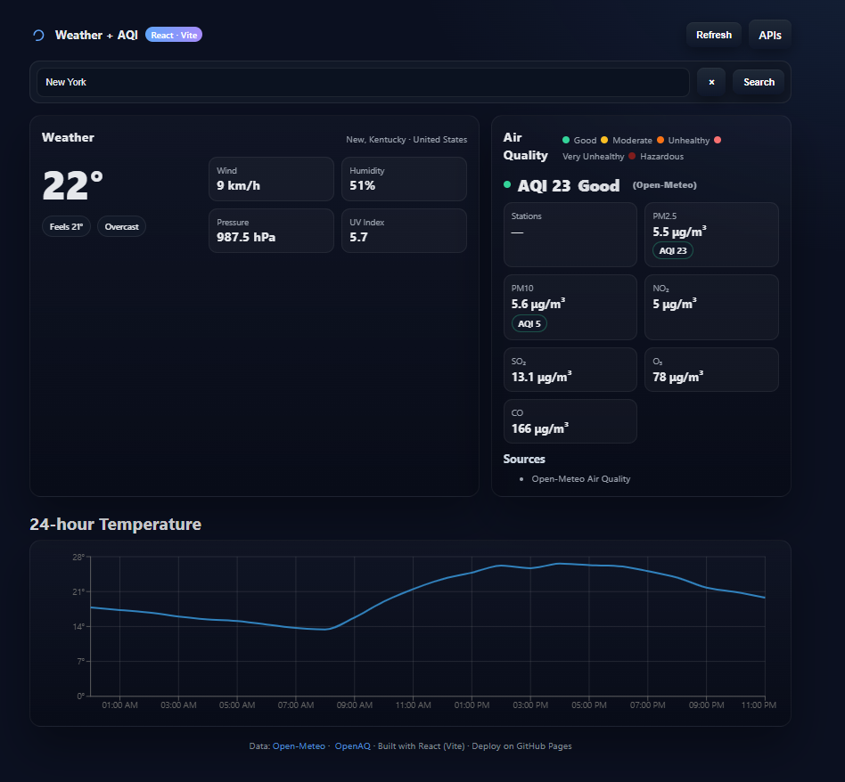

# Weather + AQI Dashboard

_End-to-end, fully client-side dashboard delivering real-time weather data, 5-day forecasts, interactive 24-hour temperature visualizations, and nearby air quality analytics (PM2.5, PM10, CO, NO₂, SO₂, O₃)—no API keys required._

<!-- Tech badges -->
<p>
  <a href="https://react.dev/">
    
  </a>
  <a href="https://vitejs.dev/">
    
  </a>
  <a href="https://recharts.org/">
    
  </a>
  <a href="https://open-meteo.com/">
    
  </a>
  <a href="https://openaq.org/">
    
  </a>
  <a href="https://pages.github.com/">
    
  </a>
</p>

<!-- Screenshot -->
<p align="center">
  
</p>

---

## Features

◦ 🌎 City search (Open-Meteo Geocoding)
◦ 🌤️ Current weather + 5-day highs/lows
◦ 📈 Next-24h temperature line chart (Recharts)
◦ 🏭 Nearby air-quality averages: PM2.5, PM10, CO, NO₂, SO₂, O₃ (OpenAQ)
◦ 💾 LocalStorage caching - 🌓 Responsive dark UI - 🔓 No API keys

## Quick Start
```bash
npm install
npm run dev
```
APIs (no keys)

- Geocoding: `https://geocoding-api.open-meteo.com/v1/search?name=Boston&count=5`
- Forecast: `https://api.open-meteo.com/v1/forecast?latitude=..&longitude=..&current_weather=true&hourly=temperature_2m&daily=temperature_2m_max,temperature_2m_min&timezone=auto`
- Air Quality: `https://api.openaq.org/v2/latest?coordinates=lat,lon&radius=15000&limit=50`

(Notes): OpenAQ may return no stations for some cities—try a larger radius or a nearby city.
